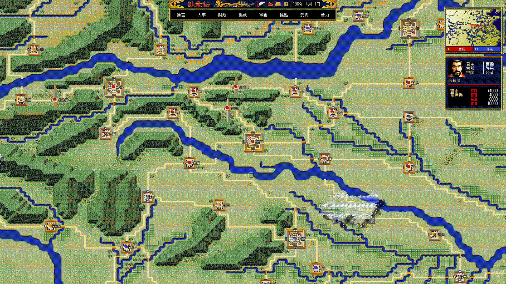
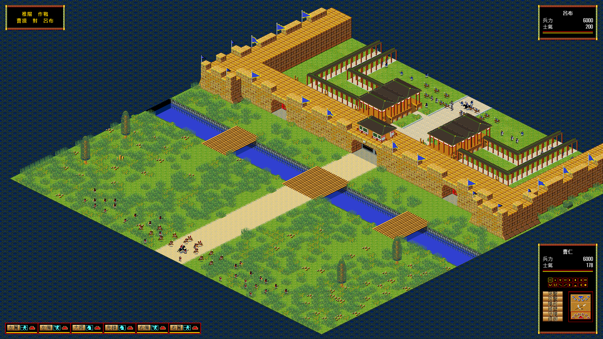

# 卧龙传 Web · Dragon

**以现代浏览器重新呈现经典三国军师战略游戏。**

原生 JavaScript ES Modules · Canvas 2D · 纯静态部署 · 浏览器本地存档

[项目背景](https://zh.wikipedia.org/wiki/卧龙传) · [在线演示](#在线演示) · [部署指南](docs/deployment.md) · [内容架构](docs/content-architecture.md) · [版权与第三方资源](THIRD_PARTY_NOTICES.md)

> 非官方、持续开发中的 Web 重构项目，不使用 DOS 模拟器，不是原作官方发行版。项目代码采用 MIT；原游戏素材、改版章节和第三方音乐等**不属于 MIT 授权范围**。公开仓库不代表这些资源已获公开再分发授权，使用或部署前请阅读版权说明。

## 项目概况

《卧龙传》是 NEO·GETEN 制作、松岗中文化发行的三国题材战略游戏，日文版于 1994 年推出，繁体中文版于 1995 年发行。与以君主为中心的传统三国游戏不同，玩家以军师身份参与势力经营、人才任用、外交与战争决策。

本项目参考原版程序、二进制数据和图像／音频资源，重新实现浏览器端规则、内容加载、交互与渲染。目标是保留军师视角和即时战略体验，同时重新组织大地图、战场和现代浏览器界面。历史背景参考维基百科；具体机制以可复核的原始证据为依据，不把百科、截图或当前实现当作原版规则证明。

### 在线演示

**演示地址：<https://dragon.720108.xyz>**

1. 演示站仅供在线体验与测试，不代表最终完成版本。
2. 项目仍在持续完善，不能保证 100% 还原原版游戏的 AI 策略与行为。
3. 本项目基于 Web 技术重构，交互方式与动画效果与原版 DOS 游戏（包括通过模拟器运行时）存在差异。
4. 欢迎游戏爱好者参与测试体验。如发现问题或有改进建议，请通过 <fczllc@163.com> 反馈，建议附上浏览器版本、所选章节、复现步骤及必要截图。

### 当前内容与特点

- **20 个内置章节**：包含原版及上、中、下、后四组改版章节，共五组，每组四章；共享同一套规则与界面内核。
- **战略经营与战争流程**：据点、武将、人事、编成、内政、外交、行军、接敌，以及野战／攻城和战后接续。
- **大地图整体呈现**：将地图图块与分层对象组织为可拖拽的大场景，不再以零散画面理解地图。
- **原生开场**：独立开场动画、资源加载进度、跳过流程与开场音轨。
- **本地四槽存档**：使用浏览器 IndexedDB，无服务器数据库、登录系统或云存档依赖。
- **静态自托管**：无需框架、打包器、npm 运行时依赖或原版安装目录；可部署到普通静态服务器、Cloudflare Pages 或 Workers Static Assets。

- **全屏体验**：使用 F11 开启浏览器全屏，效果更佳。

### 与原版呈现不同的部分

| 项目 | 当前 Web 版 |
| --- | --- |
| 战略大地图 | 384×256 格组成 6144×4096 像素整体地图，固定比例显示，拖拽平移；保留战略小地图定位、势力与军团信息。 |
| 战术大地图 | 将完整 64×64 等距战场合成为 2048×1088 大场景，使用相机裁切与拖拽；地形、人员、效果分层，配合六队卡栏和命令浮窗。 |
| 地图“合并”的含义 | 分别整合战略地图和战术地图的完整场景，**不是把战略与战术合成同一张无缝世界地图**；二者仍有独立规则和场景切换。 |
| 操作与计时 | 右键逐层返回；军师子菜单锁定地图。战略地图鼠标移动时暂停，连续静止 1 秒后按其它暂停条件决定是否恢复。 |
| 战术界面 | 当前不显示战术小地图和右下双箭头；不支持通过点击空白地面下达任意坐标移动命令。 |
| 统一之后 | 继续战略地图，尚未接入新的统一通关动画；原结局素材保留，失败 GAME OVER 流程仍在。 |

这些是 Web 产品呈现与交互决定，不构成“原版完全如此”的声明。项目仍在逆向核对与回归完善中，不宣称全部 DOS 机制或像素级表现完全等价。地图编辑器、地图扩容、任意内容包热切换、多语言和新的通关过场尚未完成。

## 游戏截图

### 开场


### 战略大地图



### 战术大地图



截图为项目开发阶段的展示，个别控件可能与当前代码不同，以实际版本为准。

## 快速开始

需要 Git、Python 3，以及支持 ES Modules、Canvas 2D、IndexedDB、Web Audio 的现代桌面浏览器。

```bash
git clone https://github.com/tianyi092-jcza/dragon.git
cd dragon
python -m http.server 8321 --directory web
```

打开 <http://localhost:8321/>。不要直接双击 `index.html` 使用 `file://` 打开。

- 推荐桌面 Chrome／Edge 等现代浏览器；完整触屏操作与跨浏览器兼容性尚未全面验证。
- 鼠标拖拽平移地图，左键选择据点／军团与菜单，右键逐层返回；部分强制交互不允许右键取消。
- 浏览器可能要求首次点击后才能播放声音。没有声音时先检查网站静音、音效设置及自动播放权限。
- 存档绑定浏览器配置与网站源（协议、域名、端口）。更换域名、无痕窗口或清除网站数据不会自动迁移存档；项目不提供云同步。
- 游戏内读取存档先回到标题流程。请勿把原版 DOS 存档复制到网站目录。

## 部署

### 私有化／自托管

完整 `web/` 可以独立运行。推荐用 Node.js 22 或更新的受支持版本生成精简发行目录：

```bash
node tools/prepare_deploy.mjs
python -m http.server 8321 --directory dist
```

该步骤只复制发布资产、不编译游戏代码、不读取原版目录。每次运行会重建仓库内的 `dist/`。音频研究材料、调试输出和说明截图不进入发行目录；结束画面仍保留。

生产环境将 `dist/` 内容作为站点根目录，经 HTTPS 提供服务。若仅供私人访问，须在反向代理或 Cloudflare Access 中配置访问控制；**自托管和私有 Git 仓库本身不等于网站已限制访问**。详见[部署指南](docs/deployment.md)。

### Cloudflare Pages：推荐自动部署

在 Cloudflare 控制台创建 **Pages → Connect to Git** 项目，授权 GitHub 仓库，使用：

| 配置项 | 值 |
| --- | --- |
| 生产分支 | `main` |
| 框架预设 | `None` |
| 仓库根目录 | 默认仓库根，不填 `web` |
| 构建命令 | `node tools/prepare_deploy.mjs` |
| 输出目录 | `dist` |
| Node.js | `22`（可设置 `NODE_VERSION=22`） |

连接后，每次推送 `main` 触发生产部署；预览分支行为在 Pages 项目设置中管理。无需将 Cloudflare 密钥写入代码。

### Cloudflare Workers Static Assets：可选

仓库提供 `wrangler.jsonc`，没有 Worker 服务端入口，也不需要数据库：

```bash
npx wrangler@4 login
npx wrangler@4 deploy
```

部署前确认目标账号与项目名，避免覆盖同名项目。CLI 会执行静态打包命令。Workers Git 自动构建、Pages 首次授权、自定义域名、缓存、404 和私有访问配置见[部署指南](docs/deployment.md)。

## 开发结构

```text
web/                  可独立运行的静态游戏
  src/                规则、导航、场景、渲染与 UI
  content/builtin/    可编辑章节与世界内容源
  intro/              原生开场场景
  grf/                游戏图像、音频及部分逆向证据
  kao/                武将头像
 tools/               离线导入、编译、分析及回归工具
 docs/                架构、原始证据笔记、部署说明与截图
 dist/                自动生成的精简发行目录（不提交）
```

游戏运行不要求 Python 或 Node.js；它们仅用于本地服务、离线工具或发布。内容生成工具可能额外依赖 Pillow，浏览器回归需要 Playwright；这些不是产品运行依赖。内容管线详见[内容架构](docs/content-architecture.md)，维护约定见 [AGENTS.md](AGENTS.md)。

基础检查示例：

```bash
node --check web/src/main.js
node tools/verify_content_catalog.mjs
node tools/verify_world_resources.mjs
node tools/verify_start_flow.mjs
node tools/prepare_deploy.mjs
git diff --check
```

报告问题时，请提供章节、浏览器版本、复现步骤、控制台错误与必要截图，不要提交真实存档、访问令牌或个人资料。

## 版权、许可与致谢

- 项目原创代码按 [MIT License](LICENSE) 许可。MIT 允许商业使用代码；本项目的非商业学习定位**不改变 MIT 的条款**。
- 原作《卧龙传》的名称、图像、音频、文本及原始数据等权利归相关权利人所有；NEO·GETEN、松岗等名称仅用于来源识别，不表示授权、合作或背书。
- 改版章节来源标注为轩辕春秋文化论坛网友 **yanguodong**；开场使用的《少林足球》Opening 音乐，项目现有来源说明标注作曲为 **黄英华**。这些来源标注不替代权利许可。
- **维护者未取得原版图片、音乐等素材的公开再分发授权。** 本项目用于学习、技术研究和非商业怀旧交流；该用途说明不意味着构成合理使用、免责或任何第三方授权。请勿将未获许可的素材用于商业用途；公开部署、再分发或其它使用前，应自行确认并取得所需许可。
- 第三方资源、改版章节、字体及展示这些内容的截图不因与代码同仓而转为 MIT。字体等有独立许可证时遵循其自身许可；具体边界见 [THIRD_PARTY_NOTICES.md](THIRD_PARTY_NOTICES.md)。

如权利人认为内容涉及其权益，请通过 GitHub Issue 或 **<fczllc@163.com>** 联系，提供涉及资源及权利说明，维护者将核实并处理，包括移除或替换。联系处理机制不消除既有使用的法律责任。

感谢原作开发与中文化团队、改版章节作者和参与研究验证的贡献者。
